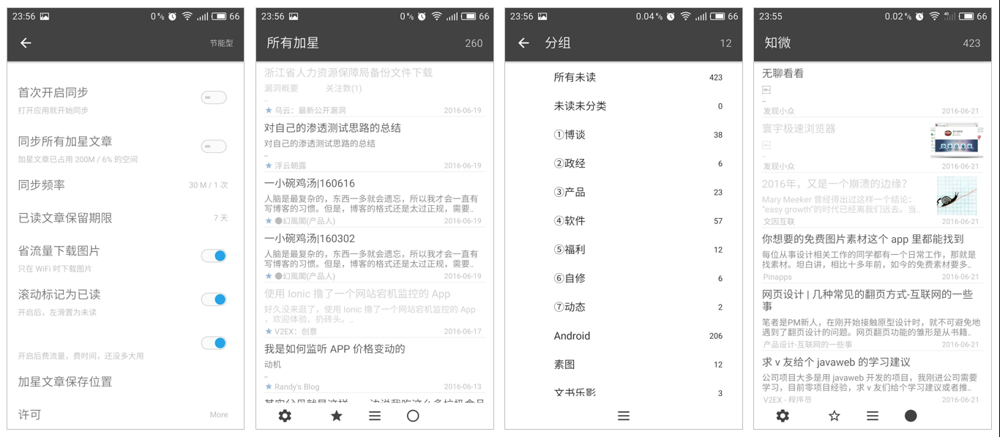

# 序

> 路很长，纵然远望，却不知方向。

> 抽支烟，思绪无常，奔跑着彷徨。

> 逃不脱的苟且，到不了的远方…

# 简介

RSS 第三方客户端，支持 Inoreader、Feedly、TinyTinyRSS。

下载地址：[http://www.coolapk.com/apk/168423](http://www.coolapk.com/apk/168423)

# 截图

如上图，从左至右依次为“登录、首页、文章页、分类、快速设置、设置”

# 功能
目前实现以下几个功能：

- [x] 黑夜主题
- [x] 获取全文：支持根据规则或智能识别全文
- [x] 保存近期文章的阅读进度
- [x] 左右切换文章
- [x] 自动清理过期文章
- [x] 不同状态下（未读/加星/全部），各分组内文章的数量
- [x] ~~保存 离线状态下的一些网络请求（文章状态处理，图片下载），待有网再同步~~

对文章列表项的手势操作：

- [x] 左滑是切换文章的“已读/未读”状态
- [x] 右滑是切换文章的“加星/取消加星”状态
- [x] 长按是“上面的文章标记为已读，下面的文章标记为已读”

PS：

* 由于开发中本人也还在不断学习，难免有些历史遗留的错误代码以及注释，暂时未被清理，但不影响使用

# 后期规划
### Bug
- [x] 优化反色算法，解决灰反色问题
- [ ] 优化音频莫名暂停问题
- [ ] 优化 ROOM 库带来的问题

### 功能
- [x] 支持全文搜索
- [ ] 优化朗读、播放音乐的界面
- [ ] 支持本地 RSS
- [ ] 支持获取不支持 RSS 站点的文章
- [ ] 支持更换主题
- [ ] 支持设置排版：字体、字号、字距、行距、背景色
- [ ] 支持长按视频，图片，iframe候展示菜单
- [ ] 本地训练机器学习模型，判断文章喜好
- [ ] 检查添加的订阅地址是否有相似的订阅

### 技术
- [ ] 优化代码结构，拆成不同模块
- [ ] 改用最新的技术，例如 Kotlin
- [ ] 使用 CI 自动构建 APK 包

# 库的使用

* OkHttp, Gson, ROOM, Glide 等等
